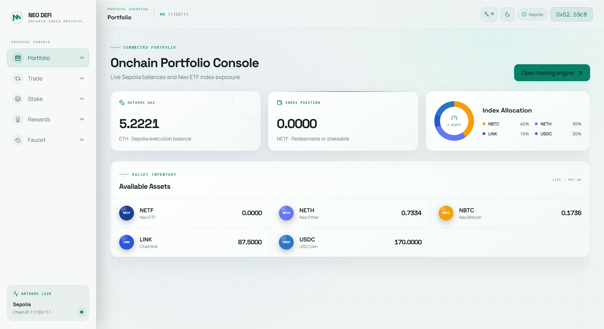
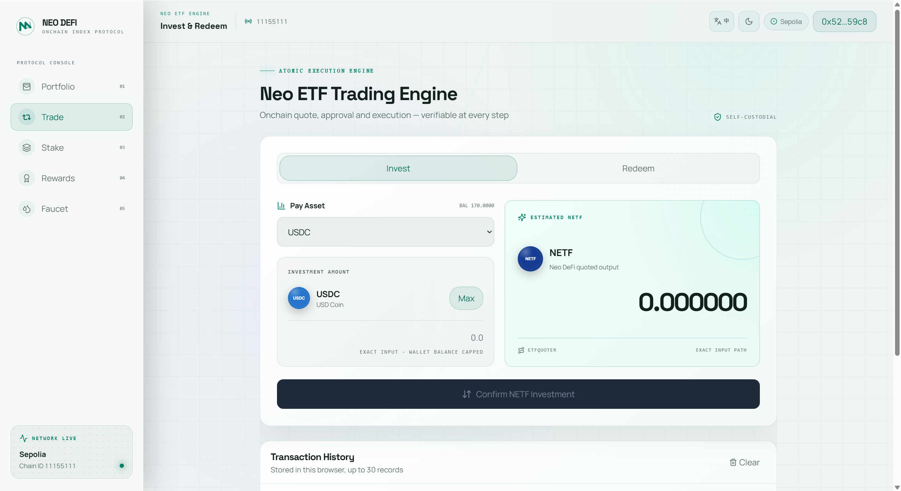
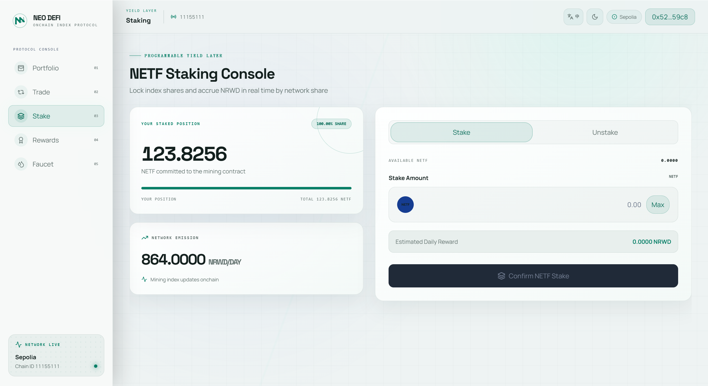
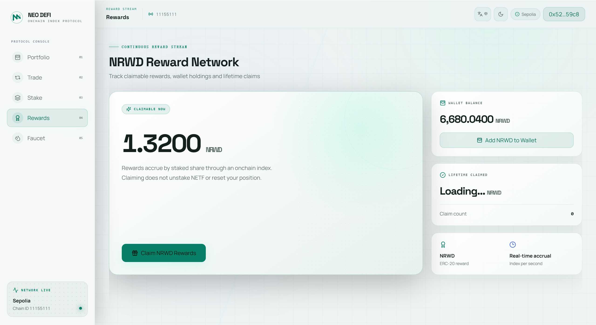
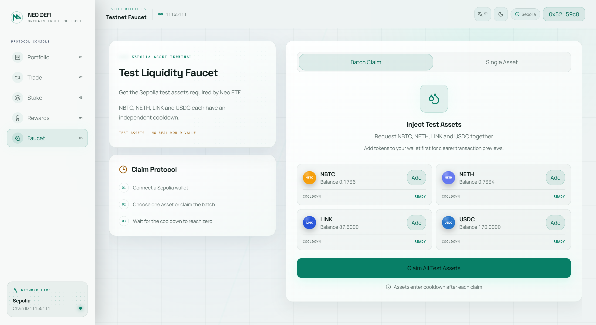

# NeoDeFi

NeoDeFi 是一个面向链上资产管理的 DeFi 项目。当前核心产品 **Neo ETF** 将多种资产组合成一个可投资、赎回和质押的链上指数产品。

本仓库是 NeoDeFi 的唯一主仓库，同时维护智能合约和前端应用。

## 核心页面

Neo ETF 前端包含五个核心页面，覆盖投资、资产管理、质押与奖励的完整流程：

| 资产总览 | 投资与赎回 | 质押中心 |
| --- | --- | --- |
| 查看钱包余额、NETF 持仓与篮子资产权重 | 使用单一代币投资或赎回 NETF | 质押 NETF 获取 NRWD 挖矿奖励 |
|  |  |  |

| 奖励中心 | 测试水龙头 |
| --- | --- |
| 查看并领取 NRWD 奖励 | 领取 Sepolia 测试网代币 |
|  |  |

## 仓库结构

```text
NeoDeFi/
├── contracts/               # Solidity + Foundry 智能合约
│   ├── src/                 # ETF 交易、报价、挖矿与水龙头合约
│   ├── test/                # Foundry 测试
│   ├── script/              # Sepolia 部署脚本
│   ├── abi/                 # 合约 ABI 源文件
│   └── lib/                 # Git submodules
├── frontend/                # Next.js + Wagmi + Viem 前端
│   ├── src/
│   ├── public/
│   └── abi_json/            # ABI 发布副本
├── scripts/                 # 仓库一致性检查
└── .github/workflows/       # 前端、合约与一致性 CI
```

## Neo ETF

Neo ETF 当前由四种测试资产组成：

| 资产 | 权重 |
| --- | ---: |
| NBTC | 40% |
| NETH | 30% |
| LINK | 10% |
| USDC | 20% |

主要用户流程：

- 使用单一代币投资并铸造 NETF
- 将 NETF 赎回为指定代币
- 质押 NETF 获取 NRWD 奖励
- 领取 Sepolia 测试代币
- 查看余额、交易进度与历史记录

## 快速开始

### 环境要求

- Git
- Node.js 20.9 或更高版本
- npm
- [Foundry](https://book.getfoundry.sh/getting-started/installation)

### 克隆与初始化

```bash
git clone --recurse-submodules https://github.com/NeoWeb3Nova/NeoDeFi.git
cd NeoDeFi
npm run setup
```

已经克隆但未下载子模块时：

```bash
git submodule update --init --recursive
```

### 启动前端

```bash
npm run dev
```

访问 `http://localhost:3000`。

### 分别验证

```bash
npm run frontend:lint
npm run frontend:build
npm run contracts:fmt
npm run contracts:build
npm run contracts:test
npm run abi:check
```

安装全部工具后，也可以运行：

```bash
npm run check
```

合约测试使用本地确定性测试私钥即可：

```bash
PRIVATE_KEY=1 npm run contracts:test
```

PowerShell：

```powershell
$env:PRIVATE_KEY = "1"
npm run contracts:test
```

三个直接读取 Sepolia 已部署资产的 ETFTrading 集成测试需要 RPC：

```bash
SEPOLIA_RPC_URL=<rpc-url> PRIVATE_KEY=1 npm run contracts:test:integration
```

PowerShell：

```powershell
$env:SEPOLIA_RPC_URL = "<rpc-url>"
$env:PRIVATE_KEY = "1"
npm run contracts:test:integration
```

## Sepolia 部署

| 合约 / 代币 | 地址 |
| --- | --- |
| ETFTrading / NETF | `0xA2286C2689d9aCd78dd482da0eb1680A668949B6` |
| ETFQuoter | `0x8114Ca0defe9313a74E41F4B1C24a49E00ebb7d5` |
| ETFMining | `0x551137eeC0Cdbb7202dB802aAF41Dab36128C20C` |
| ETFFaucet | `0x6D95910Cf46cde305bC5E390C25AFc2117a044E0` |
| NRWD | `0x11B04560B4Ea3f442Cf3AD797833C006E4F6E06b` |
| NBTC | `0xB02956728Ef9B72AdB805a5507024216dD8F0Cba` |
| NETH | `0x027f8455B1a6df72a49B8364BABaEbf8F38D20Bf` |
| LINK | `0x028268f8fF62edc596f931E17E2Fb21015f5b0A2` |
| USDC | `0x45D2b305d3e2C91b0685A3E7c83bF6D201B88aA2` |

详细部署流程见 [docs/DEPLOYMENT.md](docs/DEPLOYMENT.md)。

## 文档

- [系统架构](docs/ARCHITECTURE.md)
- [部署说明](docs/DEPLOYMENT.md)
- [仓库迁移说明](docs/REPOSITORY_MIGRATION.md)
- [贡献指南](CONTRIBUTING.md)
- [安全策略](SECURITY.md)

## 仓库迁移

原前端仓库 [`NeoWeb3Nova/NeoETF`](https://github.com/NeoWeb3Nova/NeoETF) 已并入本仓库的 `frontend/`。后续功能、问题和版本发布统一在 `NeoDeFi` 维护。

## 免责声明

当前部署运行于 Sepolia 测试网，仅用于开发和演示，不构成投资建议。
